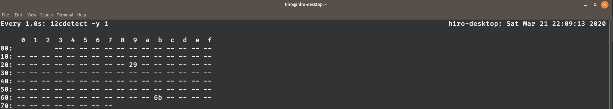

# HIRO Robotic Skin
- **Current Release**: `0.0.1` as of 2020/01/14
- **Target Python versions**: Python 2.7
- **Documentation**: http://hiro-group.ronc.one/robotic_skin/

# HTTPS Installation
```
pip install --upgrade git+https://github.com/HIRO-group/robotic_skin.git
```

# SSH Installation
```
pip install --upgrade git+ssh://git@github.com/HIRO-group/robotic_skin.git
```

# Docker

We have added Docker support for this repository. It is based on the `ros:melodic` image, and also allows Python3 to work with ROS. In order to build:

```sh

sudo apt-get install docker
docker pull ros:melodic
docker build . -t <docker-image-name>
```

`<docker-image-name>` can be any name that you choose.
To run a certain command:

```sh
docker run <docker-image-name> <command>
```

To run an interactive shell session:

```sh
docker run -it <docker-image-name>
```


# For Developers
New features and bug fixes are welcome. Send PRs. <br>
This project is using GitHub flow ([See here for details](https://guides.github.com/introduction/flow/)) for development, so do not try to push directly to master branch (It will be rejected anyway).


## Contribution Steps
1. Add your feature under `./robotic_skin/`
2. Comment classes and functions with [docstring](https://en.wikipedia.org/wiki/Docstring)
3. Add Example
4. Write Unit Test under `./tests/`
5. Run Test Locally `python setup.py test`
6. Run Test Remotely (Travis automatically deals this)
7. Run Pylint Locally with `pylint robotic_skin examples tests`, and correct the errors from this command.
8. Write Documentations under `./docs/`. See [docs/README.md](docs/README.md).

## Test [MUST]
When adding new feature such as `function`/`class`, you always and must write test(s) unless it will be rejected. <br>
Then run the test

```
python setup.py test
```

You can also use `pycodestyle`:

```
pycodestyle <script-name>.py
```

### Where should I write my features tests?
When writing tests, for example for feature_module.py, please create test module file of name test_feature_module_name.py and place exactly at the same layer of your feature module.
See below. <br>

```
├── robotic_skin
│   ├── __init__.py
│   ...
│   ├── your_awesome_module.py
...
└── tests
    ├── __init__.py
    ...
    ├── test_your_awesome_module.py
    │
    ...
```

## Testing Hardware:
To test the hardware whether it's working or not, whether the PCB is designed perfectly or not
run the below command in Raspberry Pi:
```bash
sudo watch -n 1 i2cdetect -y bus_num
```
Where bus_num is the I2C bus number in Raspbbery pi.
The output in the terminal should look something like this:

The numbers 29 and 6b which are I2C addresses (Unless you change the default I2C addresses, in that case they should appear in place of 29 and 6b) of proximity sensor and accelerometer
respectively should be visible without flickering.

## Documentation
Write documents of your new `function`/`class`/`feature` and explain what it does.
Writing documents is hard, but it helps others understanding of what you implemented and how to use it.

### Style
We use **numpy style docstring**. <br>
When writing the docs, please follow numpy style. <br>
[See here](https://numpydoc.readthedocs.io/en/latest/) for details.

## Release
Change the release version in `setup.py` and in `docs/conf.py`
