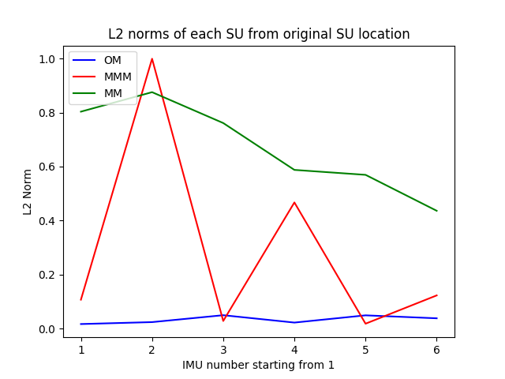

| L2 Distances   | IMU 1                                                                      | IMU 2                                                                      | IMU 3                                                                       | IMU 4                                                                       | IMU 5                                                                       | IMU 6                                                                       |
|----------------|----------------------------------------------------------------------------|----------------------------------------------------------------------------|-----------------------------------------------------------------------------|-----------------------------------------------------------------------------|-----------------------------------------------------------------------------|-----------------------------------------------------------------------------|
|                | <table><tr><th>OG</th><th>OM</th><th>MMM</th><th>MM</th></tr></table>      | <table><tr><th>OG</th><th>OM</th><th>MMM</th><th>MM</th></tr></table>      | <table><tr><th>OG</th><th>OM</th><th>MMM</th><th>MM</th></tr></table>       | <table><tr><th>OG</th><th>OM</th><th>MMM</th><th>MM</th></tr></table>       | <table><tr><th>OG</th><th>OM</th><th>MMM</th><th>MM</th></tr></table>       | <table><tr><th>OG</th><th>OM</th><th>MMM</th><th>MM</th></tr></table>       |
| L2 Norm        | <table><tr><td>0.0</td><td>0.02</td><td>0.11</td><td>0.8</td></tr></table> | <table><tr><td>0.0</td><td>0.02</td><td>1.0</td><td>0.88</td></tr></table> | <table><tr><td>0.0</td><td>0.05</td><td>0.03</td><td>0.76</td></tr></table> | <table><tr><td>0.0</td><td>0.02</td><td>0.47</td><td>0.59</td></tr></table> | <table><tr><td>0.0</td><td>0.05</td><td>0.02</td><td>0.57</td></tr></table> | <table><tr><td>0.0</td><td>0.04</td><td>0.12</td><td>0.44</td></tr></table> |

Method name OG Average Euclidean distance is 0.0

Method name OM Average Euclidean distance is 0.03

Method name MMM Average Euclidean distance is 0.29

Method name MM Average Euclidean distance is 0.67

| DH Parameters   | IMU 1                                                                           | IMU 2                                                                          | IMU 3                                                                            | IMU 4                                                                          | IMU 5                                                                            | IMU 6                                                                            |
|-----------------|---------------------------------------------------------------------------------|--------------------------------------------------------------------------------|----------------------------------------------------------------------------------|--------------------------------------------------------------------------------|----------------------------------------------------------------------------------|----------------------------------------------------------------------------------|
|                 | <table><tr><th>OG</th><th>OM</th><th>MMM</th><th>MM</th></tr></table>           | <table><tr><th>OG</th><th>OM</th><th>MMM</th><th>MM</th></tr></table>          | <table><tr><th>OG</th><th>OM</th><th>MMM</th><th>MM</th></tr></table>            | <table><tr><th>OG</th><th>OM</th><th>MMM</th><th>MM</th></tr></table>          | <table><tr><th>OG</th><th>OM</th><th>MMM</th><th>MM</th></tr></table>            | <table><tr><th>OG</th><th>OM</th><th>MMM</th><th>MM</th></tr></table>            |
| Θ0   | <table><tr><td>1.57</td><td>1.57</td><td>1.57</td><td>-0.83</td></tr></table>   | <table><tr><td>0</td><td>-0.01</td><td>-1.87</td><td>1.16</td></tr></table>    | <table><tr><td>-1.57</td><td>-1.57</td><td>-1.57</td><td>-2.19</td></tr></table> | <table><tr><td>3.14</td><td>3.14</td><td>-2.78</td><td>2.74</td></tr></table>  | <table><tr><td>-1.57</td><td>-1.57</td><td>-1.57</td><td>-1.58</td></tr></table> | <table><tr><td>1.57</td><td>1.57</td><td>1.57</td><td>1.69</td></tr></table>     |
| d               | <table><tr><td>0.06</td><td>0.05</td><td>0.07</td><td>0.76</td></tr></table>    | <table><tr><td>-0.08</td><td>-0.06</td><td>0.94</td><td>0.82</td></tr></table> | <table><tr><td>0.08</td><td>0.07</td><td>0.07</td><td>0.84</td></tr></table>     | <table><tr><td>-0.1</td><td>-0.1</td><td>-0.73</td><td>0.5</td></tr></table>   | <table><tr><td>0.03</td><td>0.05</td><td>0.02</td><td>-0.54</td></tr></table>    | <table><tr><td>0</td><td>-0.03</td><td>0.0</td><td>0.32</td></tr></table>        |
| a               | <table><tr><td>-1.57</td><td>-1.55</td><td>-1.59</td><td>0.63</td></tr></table> | <table><tr><td>0</td><td>-0.0</td><td>1.53</td><td>2.73</td></tr></table>      | <table><tr><td>1.57</td><td>1.56</td><td>1.57</td><td>2.22</td></tr></table>     | <table><tr><td>3.14</td><td>-3.14</td><td>0.12</td><td>-3.13</td></tr></table> | <table><tr><td>1.57</td><td>1.57</td><td>1.57</td><td>1.57</td></tr></table>     | <table><tr><td>-1.57</td><td>-1.57</td><td>-1.57</td><td>-0.81</td></tr></table> |
| α               | <table><tr><td>0.06</td><td>0.07</td><td>0.17</td><td>0.2</td></tr></table>     | <table><tr><td>0.05</td><td>0.06</td><td>0.12</td><td>0.06</td></tr></table>   | <table><tr><td>0.06</td><td>0.11</td><td>0.03</td><td>0.02</td></tr></table>     | <table><tr><td>0.1</td><td>0.09</td><td>0.17</td><td>0.2</td></tr></table>     | <table><tr><td>0.05</td><td>0.07</td><td>0.04</td><td>0.0</td></tr></table>      | <table><tr><td>0.05</td><td>0.06</td><td>0.2</td><td>0.17</td></tr></table>      |
| Θacc | <table><tr><td>0</td><td>0.0</td><td>0.0</td><td>0.0</td></tr></table>          | <table><tr><td>0</td><td>0.0</td><td>0.0</td><td>0.0</td></tr></table>         | <table><tr><td>0</td><td>0.0</td><td>0.0</td><td>0.0</td></tr></table>           | <table><tr><td>0</td><td>0.0</td><td>0.0</td><td>0.0</td></tr></table>         | <table><tr><td>0</td><td>0.0</td><td>0.0</td><td>0.0</td></tr></table>           | <table><tr><td>0</td><td>0.0</td><td>0.0</td><td>0.0</td></tr></table>           |
| dacc | <table><tr><td>1.57</td><td>1.56</td><td>1.58</td><td>1.21</td></tr></table>    | <table><tr><td>1.57</td><td>1.56</td><td>1.85</td><td>2.08</td></tr></table>   | <table><tr><td>1.57</td><td>1.57</td><td>1.57</td><td>1.64</td></tr></table>     | <table><tr><td>1.57</td><td>1.57</td><td>0.09</td><td>1.65</td></tr></table>   | <table><tr><td>1.57</td><td>1.57</td><td>1.57</td><td>1.47</td></tr></table>     | <table><tr><td>1.57</td><td>1.57</td><td>1.57</td><td>0.79</td></tr></table>     |

| Orientations           | IMU 1                                                                         | IMU 2                                                                           | IMU 3                                                                          | IMU 4                                                                           | IMU 5                                                                         | IMU 6                                                                        |
|------------------------|-------------------------------------------------------------------------------|---------------------------------------------------------------------------------|--------------------------------------------------------------------------------|---------------------------------------------------------------------------------|-------------------------------------------------------------------------------|------------------------------------------------------------------------------|
|                        | <table><tr><th>OG</th><th>OM</th><th>MMM</th><th>MM</th></tr></table>         | <table><tr><th>OG</th><th>OM</th><th>MMM</th><th>MM</th></tr></table>           | <table><tr><th>OG</th><th>OM</th><th>MMM</th><th>MM</th></tr></table>          | <table><tr><th>OG</th><th>OM</th><th>MMM</th><th>MM</th></tr></table>           | <table><tr><th>OG</th><th>OM</th><th>MMM</th><th>MM</th></tr></table>         | <table><tr><th>OG</th><th>OM</th><th>MMM</th><th>MM</th></tr></table>        |
| w                      | <table><tr><td>-0.5</td><td>-0.5</td><td>0.5</td><td>-0.28</td></tr></table>  | <table><tr><td>0.71</td><td>0.7</td><td>0.1</td><td>0.61</td></tr></table>      | <table><tr><td>0.48</td><td>0.5</td><td>0.5</td><td>0.18</td></tr></table>     | <table><tr><td>-0.71</td><td>-0.71</td><td>-0.01</td><td>0.72</td></tr></table> | <table><tr><td>0.48</td><td>0.5</td><td>-0.5</td><td>0.52</td></tr></table>   | <table><tr><td>0.73</td><td>0.71</td><td>0.71</td><td>0.83</td></tr></table> |
| x                      | <table><tr><td>0.5</td><td>0.5</td><td>-0.5</td><td>-0.32</td></tr></table>   | <table><tr><td>0.0</td><td>-0.0</td><td>0.79</td><td>-0.61</td></tr></table>    | <table><tr><td>-0.48</td><td>-0.5</td><td>-0.5</td><td>-0.42</td></tr></table> | <table><tr><td>0.03</td><td>0.0</td><td>0.05</td><td>-0.15</td></tr></table>    | <table><tr><td>-0.48</td><td>-0.5</td><td>0.5</td><td>-0.47</td></tr></table> | <table><tr><td>0.0</td><td>0.0</td><td>-0.0</td><td>-0.39</td></tr></table>  |
| y                      | <table><tr><td>-0.5</td><td>-0.49</td><td>0.51</td><td>0.21</td></tr></table> | <table><tr><td>-0.0</td><td>-0.0</td><td>0.1</td><td>0.47</td></tr></table>     | <table><tr><td>-0.52</td><td>-0.5</td><td>-0.5</td><td>-0.41</td></tr></table> | <table><tr><td>0.03</td><td>0.0</td><td>0.97</td><td>0.13</td></tr></table>     | <table><tr><td>-0.52</td><td>-0.5</td><td>0.5</td><td>-0.48</td></tr></table> | <table><tr><td>0.68</td><td>0.71</td><td>0.71</td><td>0.37</td></tr></table> |
| z                      | <table><tr><td>0.5</td><td>0.51</td><td>-0.49</td><td>0.88</td></tr></table>  | <table><tr><td>0.71</td><td>0.71</td><td>-0.59</td><td>-0.18</td></tr></table>  | <table><tr><td>0.52</td><td>0.5</td><td>0.5</td><td>0.79</td></tr></table>     | <table><tr><td>0.71</td><td>0.71</td><td>-0.24</td><td>-0.67</td></tr></table>  | <table><tr><td>0.52</td><td>0.5</td><td>-0.5</td><td>0.53</td></tr></table>   | <table><tr><td>-0.0</td><td>0.0</td><td>-0.0</td><td>-0.12</td></tr></table> |
| Θdifference | <table><tr><td>0.0</td><td>1.21</td><td>1.43</td><td>143.48</td></tr></table> | <table><tr><td>2.82</td><td>2.13</td><td>139.3</td><td>144.79</td></tr></table> | <table><tr><td>4.51</td><td>5.2</td><td>5.13</td><td>49.15</td></tr></table>   | <table><tr><td>3.49</td><td>4.59</td><td>163.97</td><td>23.82</td></tr></table> | <table><tr><td>4.51</td><td>5.11</td><td>5.11</td><td>7.47</td></tr></table>  | <table><tr><td>0.0</td><td>2.04</td><td>1.98</td><td>61.24</td></tr></table> |

