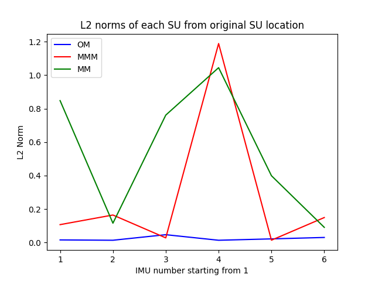

| L2 Distances   | IMU 1                                                                       | IMU 2                                                                       | IMU 3                                                                       | IMU 4                                                                       | IMU 5                                                                      | IMU 6                                                                       |
|----------------|-----------------------------------------------------------------------------|-----------------------------------------------------------------------------|-----------------------------------------------------------------------------|-----------------------------------------------------------------------------|----------------------------------------------------------------------------|-----------------------------------------------------------------------------|
|                | <table><tr><th>OG</th><th>OM</th><th>MMM</th><th>MM</th></tr></table>       | <table><tr><th>OG</th><th>OM</th><th>MMM</th><th>MM</th></tr></table>       | <table><tr><th>OG</th><th>OM</th><th>MMM</th><th>MM</th></tr></table>       | <table><tr><th>OG</th><th>OM</th><th>MMM</th><th>MM</th></tr></table>       | <table><tr><th>OG</th><th>OM</th><th>MMM</th><th>MM</th></tr></table>      | <table><tr><th>OG</th><th>OM</th><th>MMM</th><th>MM</th></tr></table>       |
| L2 Norm        | <table><tr><td>0.0</td><td>0.02</td><td>0.11</td><td>0.85</td></tr></table> | <table><tr><td>0.0</td><td>0.01</td><td>0.16</td><td>0.12</td></tr></table> | <table><tr><td>0.0</td><td>0.05</td><td>0.03</td><td>0.76</td></tr></table> | <table><tr><td>0.0</td><td>0.01</td><td>1.19</td><td>1.04</td></tr></table> | <table><tr><td>0.0</td><td>0.02</td><td>0.01</td><td>0.4</td></tr></table> | <table><tr><td>0.0</td><td>0.03</td><td>0.15</td><td>0.09</td></tr></table> |

Method name OG Average Euclidean distance is 0.0

Method name OM Average Euclidean distance is 0.02

Method name MMM Average Euclidean distance is 0.28

Method name MM Average Euclidean distance is 0.54

| DH Parameters   | IMU 1                                                                           | IMU 2                                                                           | IMU 3                                                                            | IMU 4                                                                          | IMU 5                                                                            | IMU 6                                                                            |
|-----------------|---------------------------------------------------------------------------------|---------------------------------------------------------------------------------|----------------------------------------------------------------------------------|--------------------------------------------------------------------------------|----------------------------------------------------------------------------------|----------------------------------------------------------------------------------|
|                 | <table><tr><th>OG</th><th>OM</th><th>MMM</th><th>MM</th></tr></table>           | <table><tr><th>OG</th><th>OM</th><th>MMM</th><th>MM</th></tr></table>           | <table><tr><th>OG</th><th>OM</th><th>MMM</th><th>MM</th></tr></table>            | <table><tr><th>OG</th><th>OM</th><th>MMM</th><th>MM</th></tr></table>          | <table><tr><th>OG</th><th>OM</th><th>MMM</th><th>MM</th></tr></table>            | <table><tr><th>OG</th><th>OM</th><th>MMM</th><th>MM</th></tr></table>            |
| Θ0   | <table><tr><td>1.57</td><td>1.57</td><td>1.57</td><td>-0.53</td></tr></table>   | <table><tr><td>0</td><td>0.0</td><td>1.94</td><td>1.21</td></tr></table>        | <table><tr><td>-1.57</td><td>-1.57</td><td>-1.57</td><td>-2.19</td></tr></table> | <table><tr><td>3.14</td><td>3.14</td><td>0.58</td><td>2.17</td></tr></table>   | <table><tr><td>-1.57</td><td>-1.57</td><td>-1.57</td><td>-3.05</td></tr></table> | <table><tr><td>1.57</td><td>1.57</td><td>1.57</td><td>1.57</td></tr></table>     |
| d               | <table><tr><td>0.06</td><td>0.04</td><td>0.07</td><td>0.91</td></tr></table>    | <table><tr><td>-0.08</td><td>-0.07</td><td>-0.13</td><td>0.03</td></tr></table> | <table><tr><td>0.08</td><td>0.04</td><td>0.07</td><td>0.84</td></tr></table>     | <table><tr><td>-0.1</td><td>-0.09</td><td>0.95</td><td>-0.95</td></tr></table> | <table><tr><td>0.03</td><td>0.04</td><td>0.02</td><td>0.36</td></tr></table>     | <table><tr><td>0</td><td>-0.03</td><td>0.0</td><td>0.08</td></tr></table>        |
| a               | <table><tr><td>-1.57</td><td>-1.55</td><td>-1.59</td><td>3.14</td></tr></table> | <table><tr><td>0</td><td>-0.0</td><td>-2.62</td><td>-0.91</td></tr></table>     | <table><tr><td>1.57</td><td>1.58</td><td>1.57</td><td>2.22</td></tr></table>     | <table><tr><td>3.14</td><td>-3.14</td><td>-0.84</td><td>-0.6</td></tr></table> | <table><tr><td>1.57</td><td>1.57</td><td>1.57</td><td>-0.63</td></tr></table>    | <table><tr><td>-1.57</td><td>-1.57</td><td>-1.57</td><td>-1.57</td></tr></table> |
| α               | <table><tr><td>0.06</td><td>0.06</td><td>0.17</td><td>0.01</td></tr></table>    | <table><tr><td>0.05</td><td>0.06</td><td>0.13</td><td>0.06</td></tr></table>    | <table><tr><td>0.06</td><td>0.08</td><td>0.03</td><td>0.02</td></tr></table>     | <table><tr><td>0.1</td><td>0.09</td><td>0.16</td><td>0.19</td></tr></table>    | <table><tr><td>0.05</td><td>0.07</td><td>0.04</td><td>0.07</td></tr></table>     | <table><tr><td>0.05</td><td>0.05</td><td>0.2</td><td>0.0</td></tr></table>       |
| Θacc | <table><tr><td>0</td><td>0.0</td><td>0.0</td><td>0.0</td></tr></table>          | <table><tr><td>0</td><td>0.0</td><td>0.0</td><td>0.0</td></tr></table>          | <table><tr><td>0</td><td>0.0</td><td>0.0</td><td>0.0</td></tr></table>           | <table><tr><td>0</td><td>0.0</td><td>0.0</td><td>0.0</td></tr></table>         | <table><tr><td>0</td><td>0.0</td><td>0.0</td><td>0.0</td></tr></table>           | <table><tr><td>0</td><td>0.0</td><td>0.0</td><td>0.0</td></tr></table>           |
| dacc | <table><tr><td>1.57</td><td>1.56</td><td>1.58</td><td>2.23</td></tr></table>    | <table><tr><td>1.57</td><td>1.57</td><td>1.63</td><td>1.77</td></tr></table>    | <table><tr><td>1.57</td><td>1.57</td><td>1.57</td><td>1.64</td></tr></table>     | <table><tr><td>1.57</td><td>1.57</td><td>0.77</td><td>3.14</td></tr></table>   | <table><tr><td>1.57</td><td>1.57</td><td>1.57</td><td>0.15</td></tr></table>     | <table><tr><td>1.57</td><td>1.57</td><td>1.57</td><td>1.57</td></tr></table>     |

| Orientations           | IMU 1                                                                          | IMU 2                                                                           | IMU 3                                                                            | IMU 4                                                                            | IMU 5                                                                            | IMU 6                                                                        |
|------------------------|--------------------------------------------------------------------------------|---------------------------------------------------------------------------------|----------------------------------------------------------------------------------|----------------------------------------------------------------------------------|----------------------------------------------------------------------------------|------------------------------------------------------------------------------|
|                        | <table><tr><th>OG</th><th>OM</th><th>MMM</th><th>MM</th></tr></table>          | <table><tr><th>OG</th><th>OM</th><th>MMM</th><th>MM</th></tr></table>           | <table><tr><th>OG</th><th>OM</th><th>MMM</th><th>MM</th></tr></table>            | <table><tr><th>OG</th><th>OM</th><th>MMM</th><th>MM</th></tr></table>            | <table><tr><th>OG</th><th>OM</th><th>MMM</th><th>MM</th></tr></table>            | <table><tr><th>OG</th><th>OM</th><th>MMM</th><th>MM</th></tr></table>        |
| w                      | <table><tr><td>-0.5</td><td>-0.5</td><td>-0.5</td><td>-0.25</td></tr></table>  | <table><tr><td>0.71</td><td>0.71</td><td>-0.47</td><td>0.38</td></tr></table>   | <table><tr><td>0.48</td><td>0.48</td><td>0.48</td><td>0.16</td></tr></table>     | <table><tr><td>-0.71</td><td>-0.71</td><td>0.28</td><td>0.19</td></tr></table>   | <table><tr><td>0.48</td><td>0.48</td><td>0.48</td><td>-0.19</td></tr></table>    | <table><tr><td>0.73</td><td>0.73</td><td>0.73</td><td>0.73</td></tr></table> |
| x                      | <table><tr><td>0.5</td><td>0.5</td><td>0.5</td><td>-0.31</td></tr></table>     | <table><tr><td>0.0</td><td>0.0</td><td>0.55</td><td>0.68</td></tr></table>      | <table><tr><td>-0.48</td><td>-0.48</td><td>-0.48</td><td>-0.4</td></tr></table>  | <table><tr><td>0.03</td><td>0.03</td><td>0.28</td><td>0.98</td></tr></table>     | <table><tr><td>-0.48</td><td>-0.48</td><td>-0.48</td><td>0.62</td></tr></table>  | <table><tr><td>0.0</td><td>-0.0</td><td>-0.0</td><td>0.0</td></tr></table>   |
| y                      | <table><tr><td>-0.5</td><td>-0.49</td><td>-0.51</td><td>0.91</td></tr></table> | <table><tr><td>-0.0</td><td>0.0</td><td>-0.23</td><td>0.09</td></tr></table>    | <table><tr><td>-0.52</td><td>-0.52</td><td>-0.52</td><td>-0.42</td></tr></table> | <table><tr><td>0.03</td><td>0.03</td><td>-0.13</td><td>-0.01</td></tr></table>   | <table><tr><td>-0.52</td><td>-0.52</td><td>-0.52</td><td>-0.72</td></tr></table> | <table><tr><td>0.68</td><td>0.68</td><td>0.68</td><td>0.68</td></tr></table> |
| z                      | <table><tr><td>0.5</td><td>0.51</td><td>0.49</td><td>-0.08</td></tr></table>   | <table><tr><td>0.71</td><td>0.71</td><td>0.65</td><td>0.63</td></tr></table>    | <table><tr><td>0.52</td><td>0.52</td><td>0.52</td><td>0.8</td></tr></table>      | <table><tr><td>0.71</td><td>0.71</td><td>0.91</td><td>-0.03</td></tr></table>    | <table><tr><td>0.52</td><td>0.52</td><td>0.52</td><td>-0.23</td></tr></table>    | <table><tr><td>-0.0</td><td>0.0</td><td>-0.0</td><td>0.0</td></tr></table>   |
| Θdifference | <table><tr><td>0.0</td><td>1.21</td><td>1.43</td><td>115.97</td></tr></table>  | <table><tr><td>2.82</td><td>2.02</td><td>165.64</td><td>89.55</td></tr></table> | <table><tr><td>4.51</td><td>3.22</td><td>3.19</td><td>51.8</td></tr></table>     | <table><tr><td>3.49</td><td>2.48</td><td>126.61</td><td>164.91</td></tr></table> | <table><tr><td>4.51</td><td>3.19</td><td>3.19</td><td>164.34</td></tr></table>   | <table><tr><td>0.0</td><td>0.0</td><td>0.0</td><td>0.0</td></tr></table>     |

